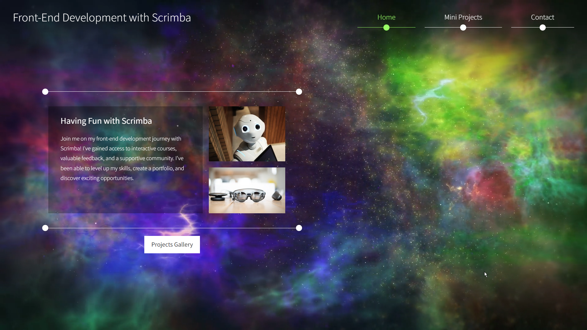

  

  <h3 align="center">Front End Development with Scrimba</h3>

  

    This Repository is dedicated on Learning more about Front end Development using Scrimba an  online learning Platform
     
     
    <a align="center" href="https://front-end-with-scrimba.netlify.app/" target="_blank">View Demo</a>

  

## Table Of Contents

* [About the Project](#about-the-project)
* [Built With](#built-with)
* [Mini Projects](#mini-projects)
* [Author](#author)
* [Acknowledgements](#acknowledgements)

## About The Project

This Page/Project is dedicated to show all the mini Projects made with Scrimba Frontend Development Career Path

The Repository content will be updated constantly. Stay Tune for updates!

## Built With

This repository will be built based on Front-end Web Development Technology such as HTML, CSS, JavaScript (React ). Landing Page is made of HTML, CSS, Javscript and Bootstrap template

### Mini Projects
* My First App - First Page made.
* Google-clone - A copy of google landing page.
* Business-card - Sample Business Card.
* Space Exploration Site - Hero Banner of Space Exploration Site
* Birthday-gift Site - A Website made for birthday celebrator
* Solo Project: Hometown Homepage

## Author

[//]: contributor-faces

[//]: contributor-faces

## Acknowledgements

* [Scrimba](https://scrimba.com/)
* [Templatemo](https://templatemo.com/)
* [Pexels](https://www.pexels.com/) - Magical Background By Oleg Gamulinskii
* [Pixabay](https://pixabay.com/) - Source of Images that are free to use
* [icons8.com](https://icons8.com/) - Source of Icons
